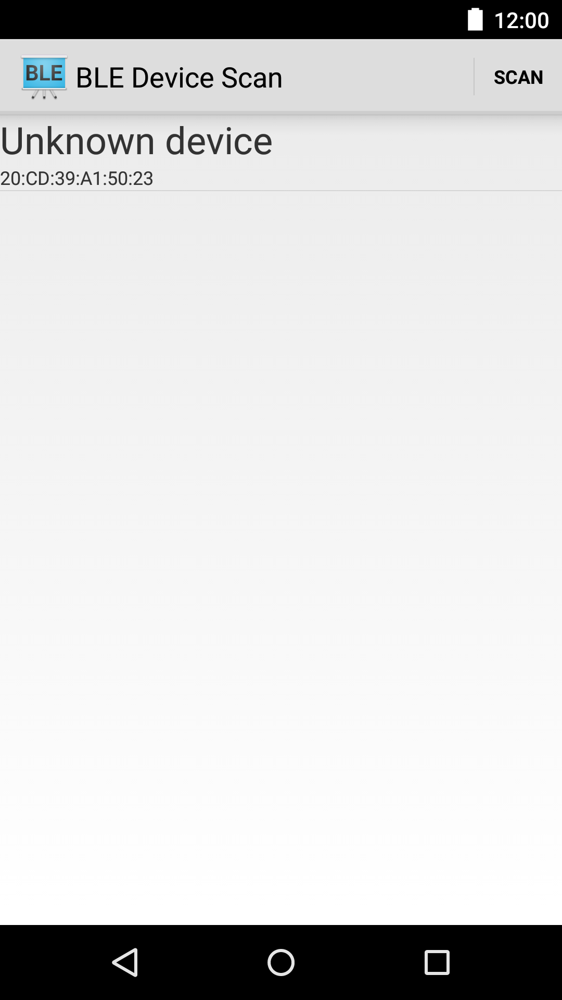
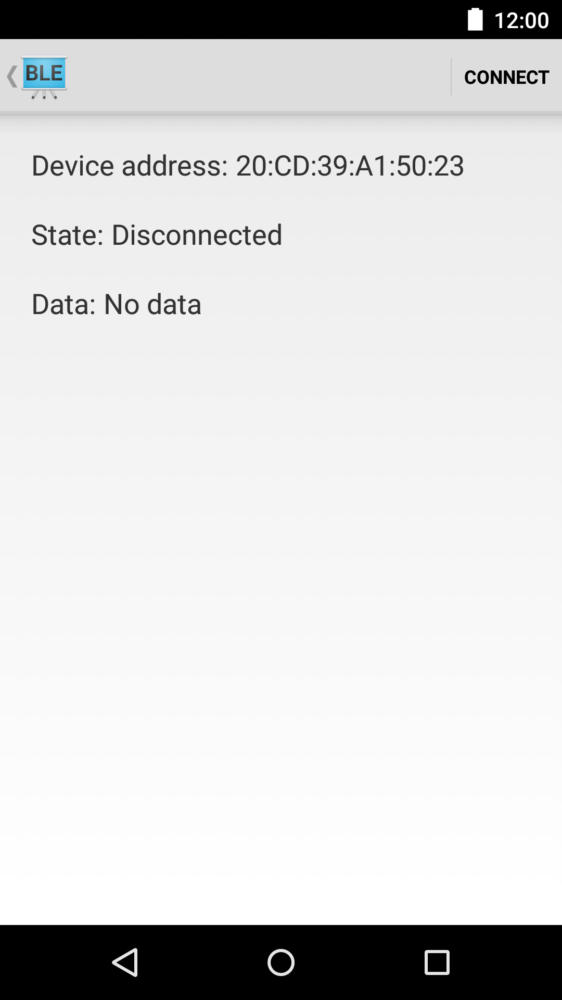

Android BluetoothLeGatt Sample
===================================

This sample demonstrates how to use the Bluetooth LE Generic Attribute Profile (GATT)
to transmit arbitrary data between devices. The original source code is get from google https://github.com/android/connectivity-samples/tree/master/BluetoothLeGatt but it not work so I implement with the location service.

Introduction
------------

This sample shows a list of available Bluetooth LE devices and provides
an interface to connect, display data and display GATT services and
characteristics supported by the devices.

It creates a [Service][1] for managing connection and data communication with a GATT server
hosted on a given Bluetooth LE device.

The Activities communicate with the Service, which in turn interacts with the [Bluetooth LE API][2].

[1]:http://developer.android.com/reference/android/app/Service.html
[2]:https://developer.android.com/reference/android/bluetooth/BluetoothGatt.html

Pre-requisites
--------------

- Android SDK 28
- Android Build Tools v28.0.3
- Android Support Repository

Screenshots
-------------

  

Getting Started
---------------

This sample uses the Gradle build system. To build this project, use the
"gradlew build" command or use "Import Project" in Android Studio.

